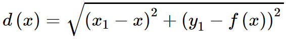

# Distance meter

Small proof of concept app to find the smallest distance between point and a graph of any math function.\
Uses [math.js](https://mathjs.org) and gradient descent algorithm.

## How to use


- Blue – your custom function graph
- Black – graph of `distance(x)` function (just for illustration, **not used in calculations**)
- Red – current position of smallest distance point (just for illustration)
- Green – smallest distance path

Position of mouse = position of the starting point.\
Gradient descent starts after 500ms of inactivity.\
Found minimal distance is displayed at the bottom.

## How it works

Let `x1`,`y1` = starting point coordinates.\
Let `x`,`y` = target point coordinates. (point on function where the distance is minimal)\
Let `f(x)` = function formula

Then


`y = f(x)`



This is the target function that we need to minimize, where `x` is the only variable, as of `x1` and `y1` are known

In the code `f(x)` is injected to the `d(x)` in the direct way:\
```distanceFormulaText = `sqrt(pow(x1-x, 2)+pow(y1-(${formula.toString()}) , 2))` ```

To perform gradient descent we need a derivative of this function (by `x`)\
`const deriv = math.derivative(distanceFormulaText, 'x')`

Then the gradient descent starts, updating the target point on the graph every 200 iterations.\
Initial `x` is taken as `x1`, learning rate is taken nearly by random  

## Disadvantages
- Too slow to use on every mouse move, but we haven't found any better solution _(yet?)_
- Gets stuck in local minimums too often

## Authors
- [Loskir](https://github.com/Loskir)
- [Egor Voron](https://github.com/EgorVoron)

## License
Licensed under MIT License\
&copy;Loskir&Voron 2019
